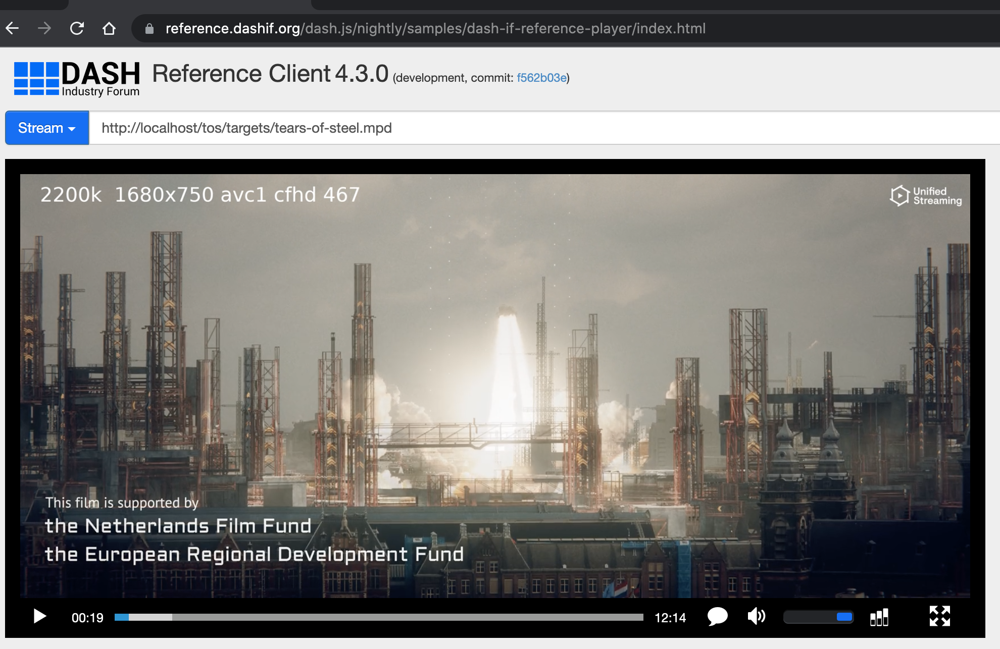

# What is Origin CMSD?
Origin CMSD is an experimental project for testing CTA-WAVE's Common Media
Server Data (CMSD) proposal. 

The objective of CMSD's proposal is to generate a specification on how every
media server (intermediate and origin) can communicate data with each media
object response, and have it received and processed consistently by every
intermediate server and player.
Using CMSD proposal is expected to increase efficiency and performance in
distributing media workflows. Consequently, improve the quality of
experience (QoE) for end-users.


## Usage

This project contains prepacked content of [Tears of Steel](https://mango.blender.org/)
in MPEG-DASH media fragments format using Unified Packager [(mp4split)](https://docs.unified-streaming.com/documentation/package/index.html#).

Each video track is encoded with 96 closed GOP and with the
following encoding specifications:

|Track        |Resolution | Bitrate [kbps]| Codec | Profile  |
|-------------|-----------|---------------|-------|----------|
|tos-avc1-400k.cmfv|  224x100  |   400         |  avc1 |   CB@1.3 |
|tos-avc1-750k.cmfv|  448x200  |   750         |  avc1 |   CB@2.2 | 
|tos-avc1-1000k.cmfv|  784x350  |   1000        |  avc1 |   Main@3.1 | 
|tos-avc1-1500k.cmfv|  1680x750  |   1500        |  avc1 |   High@4.0 | 
|tos-avc1-2200k.cmfv|  1680x750  |   2199        |  avc1 |   High@4.0 | 
|tos-aac-64k.cmfa|  NA  |   64        |  aac |   LC@ | 
|tos-aac-128k.cmfa|  NA  |   128        |  aac |   LC@ | 
|tos-aac-en.cmft|  NA  |   NA        |  NA |   NA | 
|tos-aac-nl.cmft|  NA  |   NA        |  NA |   NA | 


## Setup

```bash
                       [Apache2]  <-- [Varnish cache] <-- client request
[Local disk] <-- MPEG-DASH segment

 tears-of-steel.mpd
 tears-of-steel-audio_eng=128002-0.dash
 tears-of-steel-video_eng=2200000-2400.dash
 tears-of-steel-textstream_eng=1000-4000.dash
 . . . etc.
```


### Requirements
- [Git LFS](https://git-lfs.github.com/)
- [Docker](https://docs.docker.com/get-docker/)
- [Docker Compose](https://docs.docker.com/compose/)

### Download repository

Because the media segments are tracked using Git LFS we use the following 
commands to download the media:

```bash
git clone https://github.com/unifiedstreaming/origin-cmsd.git
cd origin-cmsd
du -h static-media/tos/targets/
# 6.2M	static-media/tos/targets/
git lfs pull
du -h static-media/tos/targets/
# 562M	static-media/tos/targets/
```

You will notice that after running `git lfs pull`, the media content has
grown from 6.2MB to around 562MB.


#### Start the containers:
```bash
docker-compose up -d
```

- Varnish cache MPD location: http://localhost/tos/targets/tears-of-steel.mpd
- Origin MPD location:  http://localhost:8080/tos/targets/tears-of-steel.mpd


#### Stop the containers:
```bash
docker-compose down
```

### Examples
Example 1: Request of MPEG-DASH MPD.
```bash
curl -v http://localhost/tos/targets/tears-of-steel.mpd > /dev/null 
  % Total    % Received % Xferd  Average Speed   Time    Time     Time  Current
                                 Dload  Upload   Total   Spent    Left  Speed
  0     0    0     0    0     0      0      0 --:--:-- --:--:-- --:--:--     0*   Trying ::1...
* TCP_NODELAY set
* Connected to localhost (::1) port 80 (#0)
> GET /tos/targets/tears-of-steel.mpd HTTP/1.1
> Host: localhost
> User-Agent: curl/7.64.1
> Accept: */*
> 
< HTTP/1.1 200 OK
< Date: Fri, 18 Feb 2022 10:47:28 GMT
< Server: Apache/2.4.51 (Unix)
< Last-Modified: Fri, 18 Feb 2022 09:42:04 GMT
< ETag: "286c-5d847b2037042"
< Content-Length: 10348
< CMSD-Load: load=l=0.03/0.04/0.01, idle=i=99%, busy=b=0%
< Access-Control-Allow-Headers: origin, range
< Access-Control-Allow-Methods: GET, HEAD, OPTIONS
< Access-Control-Allow-Origin: *
< Access-Control-Expose-Headers: Server,range
< Cache-Control: max-age=2
< X-Varnish: 98440
< Age: 0
< Via: 1.1 varnish (Varnish/6.5)
< X-Cache: MISS
< X-Request-ID: 281979283
< CMSD-Static: ot=m, sf=d, st=v, rid=281979283
< CMSD-Dynamic: t=1645181248753580, n="USP-123", etp=XXXX, rtt=XXXX, n="Varnish-123", etp="2XX" , rtt=0.000
< Accept-Ranges: bytes
< Connection: keep-alive
< 
{ [10348 bytes data]
100 10348  100 10348    0     0   673k      0 --:--:-- --:--:-- --:--:--  673k
* Connection #0 to host localhost left intact
* Closing connection 0
```

Example 2: Request of media segments.
```bash
curl -v  http://localhost/tos/targets/tears-of-steel-video_eng\=401000-57600.dash > /dev/null                                   130 ↵  ✹ ✭25-clean-CMSD-files-add-hls-media

  % Total    % Received % Xferd  Average Speed   Time    Time     Time  Current
                                 Dload  Upload   Total   Spent    Left  Speed
  0     0    0     0    0     0      0      0 --:--:-- --:--:-- --:--:--     0*   Trying ::1...
* TCP_NODELAY set
* Connected to localhost (::1) port 80 (#0)
> GET /tos/targets/tears-of-steel-video_eng=401000-57600.dash HTTP/1.1
> Host: localhost
> User-Agent: curl/7.64.1
> Accept: */*
>
< HTTP/1.1 200 OK
< Date: Fri, 18 Feb 2022 10:46:42 GMT
< Server: Apache/2.4.51 (Unix)
< Last-Modified: Fri, 18 Feb 2022 09:42:03 GMT
< ETag: "2f5e0-5d847b1eeee93"
< Content-Length: 194016
< CMSD-Load: load=l=0.07/0.05/0.01, idle=i=99%, busy=b=0%
< Access-Control-Allow-Headers: origin, range
< Access-Control-Allow-Methods: GET, HEAD, OPTIONS
< Access-Control-Allow-Origin: *
< Access-Control-Expose-Headers: Server,range
< Cache-Control: max-age=300
< X-Varnish: 262316
< Age: 0
< Via: 1.1 varnish (Varnish/6.5)
< X-Cache: MISS
< X-Request-ID: 998774790
< CMSD-Static: ot=v, sf=d, br=401000, st=v, rid=998774790
< CMSD-Dynamic: t=1645181202780724, n="USP-123", etp=XXXX, rtt=XXXX, n="Varnish-123", etp="2XX" , rtt=0.000
< Accept-Ranges: bytes
< Connection: keep-alive
<
{ [13729 bytes data]
100  189k  100  189k    0     0  7017k      0 --:--:-- --:--:-- --:--:-- 7017k
* Connection #0 to host localhost left intact
* Closing connection 0

```

Example playback in DASH-IF reference player:



## Supported Key-Value Pairs in CMSD Headers

| Description 	| Key Name 	| Header Name 	| Type & Unit 	| Value Definition 	|
|---	|---	|---	|---	|---	|
| Timestamp 	| t 	| CMSD-Dynamic 	| Integer [milliseconds] 	| Milliseconds since Unix Epoch in UTC. This value MUST be NTP synchronized and MUST  represent the time at which the intermediate server began the response. 	|
| Entity identifier 	| n 	| CMSD-Dynamic & CMSD-Static 	| String 	| An identifier for the processing server. Maximum length of 64 characters. The value should identify both the organization and the intermediate server that is writing the key. 	|
| Object type 	| ot 	| CMSD-Static 	| Token - one of [m,a,v,av,i,c,tt,k,o] 	| The media type of the current object being returned:<br><br>m = text file, such as a manifest or playlist<br><br>a = audio only<br><br>v = video only<br><br>i = init segment<br><br>c = caption or subtitle<br><br>tt = ISOBMFF timed text track<br><br>o = other<br><br>If the object type being returned is unknown, then this key MUST NOT be used. 	|
| Stream type 	| st 	| CMSD-Dynamic 	| Token - one of [v,l] 	| v = all segments are available – e.g., VOD<br><br>l = segments become available over time – e.g., LIVE 	|
| Streaming format 	| sf 	| CMSD-Static 	| Token - one of [d,h,s,o] 	| The streaming format defines the current response.<br><br>d = MPEG DASH<br><br>h = HTTP Live Streaming (HLS)<br><br>s = Smooth Streaming<br><br>o = other<br><br>If the streaming format being returned is unknown, then this key MUST NOT be used. 	|
| Encoded bitrate 	| br 	| CMSD-Static 	| Integer [Kilobit per second] 	| The encoded bitrate of the audio or video object being requested. If the instantaneous bitrate varies over the duration of the object, the peak value should be communicated. 	|
| Request ID 	| rid 	| CMSD-Static 	| String 	| A request ID, issued by the player or an upstream component, that is received by the origin when processing inbound content requests. 	|


### Possible alternatives for implementing unsupported Key-Value Pairs from CMSD

The unsupported Key-Value pairs from CMSD proposal can potentially be
implemented by using the following modules at the Origin server:

- [Apache2 mod_lua](https://httpd.apache.org/docs/trunk/mod/mod_lua.html)
- [Apache2 mod_fcgid](https://httpd.apache.org/mod_fcgid/mod/mod_fcgid.html)

The intermediate server can be implemented using the most popular servers such
as Varnish Cache or Varnish Cache plus. These two HTTP reverse proxies have
plenty of VMODs that can modify HTTP request/response Headers based on the 
specific use case and requirements.
